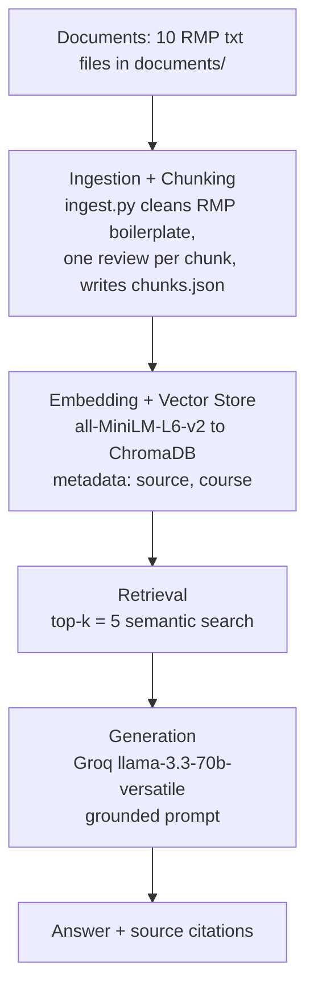

# Project 1 Planning: The Unofficial Guide

> Write this document before you write any pipeline code.
> Your spec and architecture diagram are what you'll use to direct AI tools (Claude, Copilot, etc.) to generate your implementation — the more specific they are, the more useful the generated code will be.
> Update the Retrieval Approach and Chunking Strategy sections if you change your approach during implementation.
> Update this file before starting any stretch features.

---

## Domain

Student reviews of **Computer Science professors at the University of Texas at Dallas**, collected from RateMyProfessors. The system answers plain-language questions about teaching style, workload, exam format, and which courses a professor is good/bad for.

This knowledge is hard to find officially because the course catalog describes *what* a course covers, not *how* a professor teaches it. The lived experience exists only in student-to-student reviews, scattered across hundreds of individual ratings per professor.

---

## Documents

10 professor pages from [RateMyProfessors](https://www.ratemyprofessors.com), UT Dallas Computer Science department. Each file contains the full set of student reviews across **all courses** that professor teaches.

| # | Source | Description | URL or location |
|---|--------|-------------|-----------------|
| 1 | Gordon Arnold | RMP reviews, all CS courses | [`rmp_gordon_arnold.txt`](documents/rmp_gordon_arnold.txt) \| [RMP URL](https://www.ratemyprofessors.com/professor/1976371) |
| 2 | Shyam Karrah | RMP reviews, all CS courses | [`rmp_shyam_karrah.txt`](documents/rmp_shyam_karrah.txt) \| [RMP URL](https://www.ratemyprofessors.com/professor/1554657) |
| 3 | Jason Smith | RMP reviews, all CS courses | [`rmp_jason_smith.txt`](documents/rmp_jason_smith.txt) \| [RMP URL](https://www.ratemyprofessors.com/professor/1833058) |
| 4 | Srimathi Srinivasan | RMP reviews, all CS courses | [`rmp_srimathi_srinivasan.txt`](documents/rmp_srimathi_srinivasan.txt) \| [RMP URL](https://www.ratemyprofessors.com/professor/2424646) |
| 5 | Priya Narayanasami | RMP reviews, all CS courses | [`rmp_priya_narayanasami.txt`](documents/rmp_priya_narayanasami.txt) \| [RMP URL](https://www.ratemyprofessors.com/professor/2337456) |
| 6 | Neeraj Gupta | RMP reviews, all CS courses | [`rmp_neeraj_gupta.txt`](documents/rmp_neeraj_gupta.txt) \| [RMP URL](https://www.ratemyprofessors.com/professor/1916155) |
| 7 | Miguel Razo | RMP reviews, all CS courses | [`rmp_miguel_razo.txt`](documents/rmp_miguel_razo.txt) \| [RMP URL](https://www.ratemyprofessors.com/professor/1607810) |
| 8 | Brian Ricks | RMP reviews, all CS courses | [`rmp_brian_ricks.txt`](documents/rmp_brian_ricks.txt) \| [RMP URL](https://www.ratemyprofessors.com/professor/2822326) |
| 9 | Laurie Thompson | RMP reviews, all CS courses | [`rmp_laurie_thompson.txt`](documents/rmp_laurie_thompson.txt) \| [RMP URL](https://www.ratemyprofessors.com/professor/191259) |
| 10 | Scott Dollinger | RMP reviews, all CS courses | [`rmp_scott_dollinger.txt`](documents/rmp_scott_dollinger.txt) \| [RMP URL](https://www.ratemyprofessors.com/professor/2523207) |

---

## Chunking Strategy

**Chunk size:** One review per chunk, typically 300 to 600 characters. A review longer than about 800 characters is split, with a small overlap; shorter reviews are kept whole.

**Overlap:** About 80 characters, applied only when a single long review must be split. There is no overlap between separate reviews, since each review is already a self-contained unit and bleeding one student's opinion into another would muddy retrieval.

**Reasoning:** RMP data is review-heavy, not long-form prose, so the strategy is review-aware: one review per chunk, with the professor name and course code prepended, for example `Professor Arnold, CS1337: "..."`.

- **One review per chunk** keeps each chunk a complete thought and preserves attribution, so the system knows which professor and course a comment refers to.
- **300 to 600 characters** is the size of a typical review plus its label, small enough to stay inside the model's 256-token limit and large enough to avoid fragments.
- **Too small, under ~150 characters:** a chunk holds only part of one opinion, so the question "are his exams hard" can retrieve "his exams are heavily" without the verdict that follows, giving the model half an answer.
- **Too large, over ~800 characters:** one chunk ends up covering exams, attendance, humor, and grading at once, so its embedding sits between all those topics and matches no single query strongly.

---

## Retrieval Approach

**Embedding model:** `all-MiniLM-L6-v2` via `sentence-transformers`. It runs locally with no API key or rate limits, is small and fast, and handles short text like reviews well. It also enables semantic search: queries and reviews are compared by meaning, not exact words, so "is his grading harsh" can match a review that says "tough grader" even with no shared terms.

**Top-k:** 5. Five reviews give the LLM enough corroborating opinions to summarize a consensus. Fewer risks missing the one review that answers the question; more dilutes the context with loosely related reviews.

**Production tradeoff reflection:** If I deployed this for real users and cost were not a constraint, I would weigh three factors when choosing a different embedding model:

- **Accuracy on domain-specific text:** a larger or domain-tuned model from a hosted API would capture slang and course-code semantics better than MiniLM.
- **Context length:** MiniLM truncates around 256 tokens, fine for single reviews but limiting if I later index long guides.
- **Latency and hosting:** local MiniLM has zero per-query cost but uses my own CPU or GPU, while a hosted API adds network latency and per-call cost but scales better.

---

## Evaluation Plan

| # | Question | Expected answer |
|---|----------|-----------------|
| 1 | What should students watch out for in Professor Karrah's class? | Pop quizzes, especially late in the semester. |
| 2 | Which CS professor is the most recommended, and which is the most warned against? | Most recommended: Brian Ricks, 4.7 with 92% would take again. Most warned against: Laurie Thompson, 2.2 with 15%. |
| 3 | Why do students recommend Arnold for CS1200 but warn against him for other CS courses like CS1337? | CS1200 is easy with only 3 assignments and no exams; his other courses are textbook-heavy with hard exams and little review material. |
| 4 | What went wrong with Professor Jason Smith's final exam? | He gave out the wrong version of the final, so affected students retook the correct one. |
| 5 | What percentage of students said they would take Professor Arnold again? | 49% |

---

## Anticipated Challenges

1. **RMP boilerplate pollutes chunks.** Each page is wrapped in navigation text, per-review interface labels like "Helpful", "Thumbs up", and their counts, a rating-distribution block, and a footer. If cleaning does not strip these, chunks fill with meaningless tokens that weaken embeddings and pull retrieval off target. Mitigation: targeted line-level cleaning before chunking.

2. **Summary stats have no prose context.** Facts such as the "would take again" percentage or the one-to-five star distribution appear as bare label and number pairs, not sentences. They embed as low-signal fragments or get removed as boilerplate, so semantic search cannot match a natural-language question to them, and the model may invent a plausible number instead. This is the expected failure behind Evaluation Question 5.

3. **Course attribution can blur.** A single professor teaches several courses with opposite reputations. Arnold is great for CS1200 but poor for CS1337. If the course code is not kept inside each chunk, retrieval conflates the courses and the system cannot say which course a complaint belongs to. Mitigation: prepend professor name and course code to every chunk.

---

## Architecture

---

## AI Tool Plan

**Milestone 3 — Ingestion and chunking:** I will give Claude my Chunking Strategy section plus one sample file, `rmp_gordon_arnold.txt`, and ask it to implement `ingest.py`: a cleaner that strips RMP boilerplate and a review-aware chunker that emits one chunk per review with the professor name and course code prepended. I will verify by running `python ingest.py inspect`, reading 5 sample chunks, and checking the total chunk count lands in the expected range.

**Milestone 4 — Embedding and retrieval:** I will give Claude my Retrieval Approach section and the architecture diagram and ask it to implement `embed.py`: embed each chunk with `all-MiniLM-L6-v2`, store it in ChromaDB with source and course metadata, and expose a `retrieve(query, k=5)` function. I will verify by running my test questions and confirming the returned chunks are on-topic with distance scores below about 0.5.

**Milestone 5 — Generation and interface:** I will give Claude my grounding requirement, answer from retrieved context only and otherwise refuse, plus the output format of an answer followed by a source list, and ask it to implement `query.py` with a strict system prompt and programmatic source attribution, along with a Gradio `app.py`. I will verify that an in-scope question returns a cited answer and an out-of-scope question returns the refusal.
